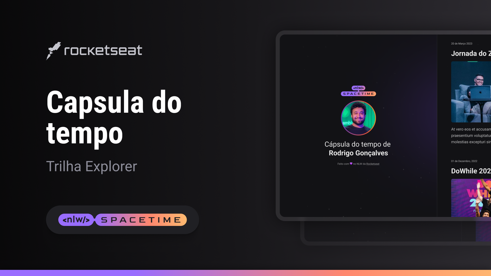

## 🖥️ Projeto
Esse é um projeto web responsivo de uma cápsula do tempo

## 🚀 Tecnologia
Esse projeto foi desenvolvido durante a NLW da Rochetseat com as senguintes tecnologias:

- HTML
- CSS
- Git e Github

## 🏷️ Layout
Você pode visualizar o layout do projeto através [deste link] (https://www.figma.com/file/pxZ90INo11hKxqs97wvQeH/C%C3%A1psula-do-tempo-%E2%80%A2-Luiz-Bufato?type=design&node-id=0%3A1&t=9KLMgy3mzvUvOFNk-1).
É necessário ter uma conta no [Figma](https://www.figma.com)
